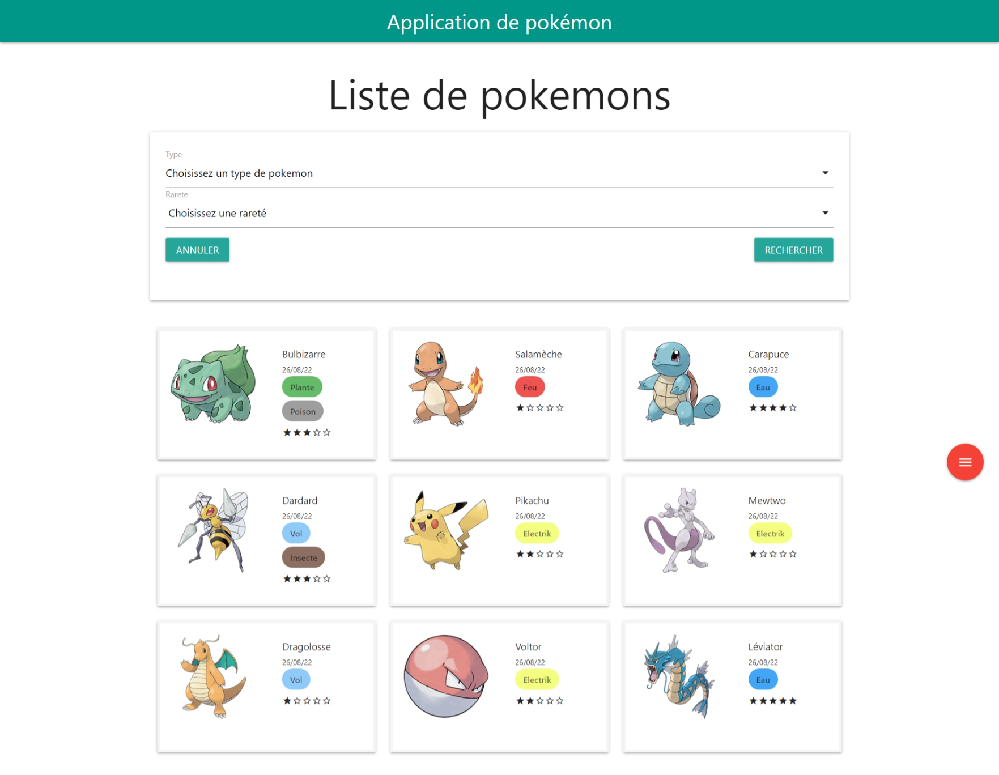
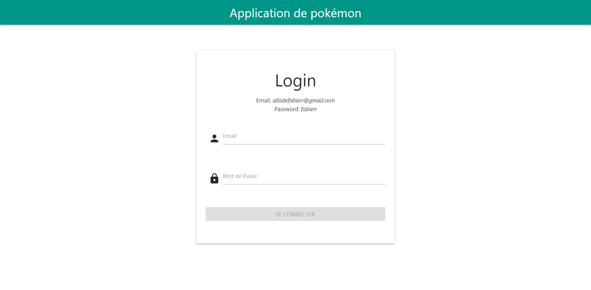
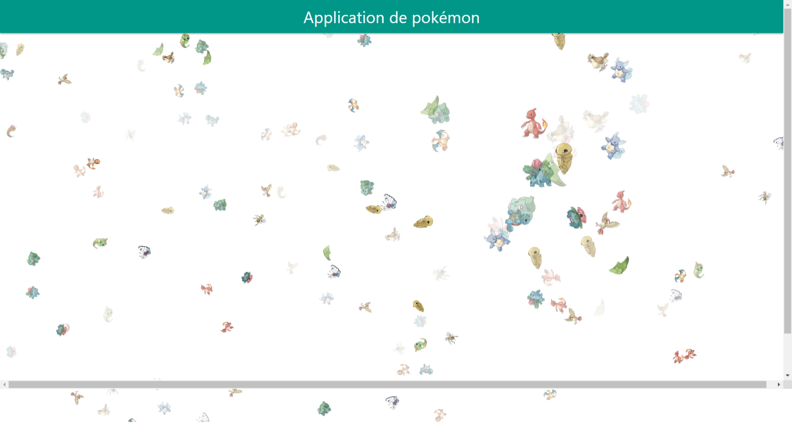
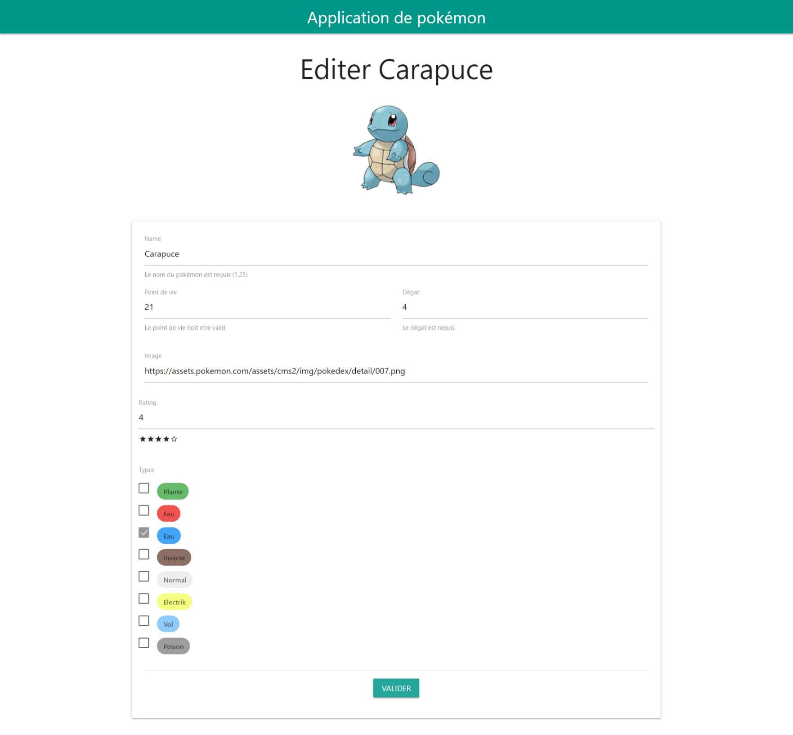

# Pokemon App
Pokemon App est une application qui possedent plusieurs petites
fonctionnalités comme:
- Un crud basique
- Une page de details
- Une page album qui présente de façon aléatoire des images
  de pokemon
- Une page d'affichage et de filtrages des pokemons présent



## Login
Les informations pour la connexion sont inscrit juste au dessus 
du formulaire



## Album Animation Page

## Formulaire pokémon


## Technologie Utilisée
- Angular 13  (https://angular.io/)
- Joi (https://www.npmjs.com/package/@hapi/joi)
- ng-particules (https://www.npmjs.com/package/ng-particles)
- materilize css (https://materializecss.com/)

### Utilisation
````
npm install
ng serve
````

--------
